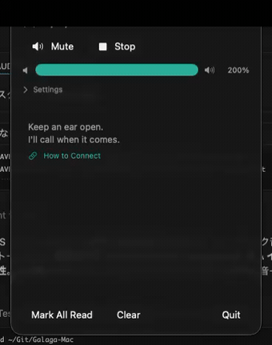

# VyNy — Ear First Computing

[English](README.md) · **日本語**

> 大事なことを、画面を見ずに耳で受け取る。

VyNy は通知・メッセージ・イベントを音声合成で読み上げます。目は世界へ、画面から解放されます。外出先でも、デスクでの集中作業中でも、根底にあるのは一つのアイデア：**耳ファースト**。

VyNy はひとつではなく、性格の違う複数のプロジェクトの総称です。**Product** はロードマップを持ち継続開発するもの、**Lab** は現状のまま共有する実験的な試みです。

---

## プロジェクト

### Products

ロードマップとサポートを持ち、継続開発しています。

| プラットフォーム | 用途 | ステータス | 入手 |
|---|---|---|---|
| **VyNy for Android** | 日常・外出先 — 通知・メッセージ・時刻を Bluetooth イヤホンで読み上げ | 配信中 | [Google Play](https://play.google.com/store/apps/details?id=jp.nain.aplay&utm_source=github&utm_medium=readme&utm_campaign=vyny_android) |
| **VyNy for iOS** | 同上、iPhone 版 | 計画中 | Coming soon |

### Lab

実験的なサイドプロジェクト。**現状のまま提供・サポートや修正・アップデートの保証はありません**。自己判断でご利用ください。

| プラットフォーム | 用途 | ステータス | 入手 |
|---|---|---|---|
| **VyNy for Mac** | 開発者向け — Claude Code の完了・エラー・待機を耳で受け取り、画面を監視する必要をなくす | 配信中 | [Releases](../../releases) — 最新の `.dmg` をダウンロード |

---

## VyNy for Mac (Lab)

> コーディングを続けながら、Claude Code が終わったら耳で知る。画面を監視しなくていい。

**今 VyNy for Mac ができるのは、Claude Code の状態を声で伝えること** — 実行が完了したとき、入力待ちになったとき、エラーが起きたとき — 画面を何度もチラ見しなくて済みます。長い処理を走らせて別の作業に集中し、必要なときだけ耳が教えてくれます。複数のセッションを並行していても、全部を見ていることはできない — だから、それぞれに喋らせましょう。

> Claude Code の **Completion / Error / Reply / Urgent** イベントがメニューバーに届き、読み上げられる様子（英語 UI）。▶︎ [音声つきで見る (MP4)](docs/demo.mp4)

### なぜ作ったか

Claude Code の動きを見守るということは、画面を監視し続けることです — 終わった？詰まった？待ってる？その確認は純粋な集中コストであり、並行セッションが増えるほど悪化します。VyNy は実際に注意を要する 4 つのイベント — **Completion, Error, Reply, Urgent** — を、発生した瞬間に声で伝えます。目は本当の作業に向けたまま、必要なときだけ戻ればいい。

### 仕組み

| 要素 | 詳細 |
|---|---|
| **オンデバイス TTS** | 音声合成はデバイス上で完結。テキストが外部サーバーに送信されることはありません。 |
| **4 イベントモデル** | Claude Code のアクティビティを Completion / Error / Reply / Urgent の 4 種類に正規化します。 |
| **3 つのモード** | Desk / Run / Walk で読み上げの挙動を切り替え、状況に合わせた使い方ができます。 |

### インストール

> 現状のまま提供。サポートや保証はありません — [SUPPORT.md](SUPPORT.md) をご覧ください。

1. [Releases](../../releases) から最新の `.dmg` をダウンロードします。
2. DMG を開き、**VyNy** を **Applications** フォルダにドラッグします。
3. 起動します。ビルドは Apple の公証済みのため、そのまま開けるはずです。警告が表示された場合は **システム設定 → プライバシーとセキュリティ** から **このまま開く** を選択してください。

---

## フィードバック

- **バグ報告** → [Issues](../../issues)（テンプレートに従い、再現手順を含めてください）
- **質問・アイデア・要望・雑談** → [Discussions](https://github.com/NainJp/VyNy/discussions)

返信はベストエフォートです。特に Lab プロジェクトについては返信を保証できません。

---

## サポート

詳細なポリシーは [SUPPORT.md](SUPPORT.md) をご覧ください。
